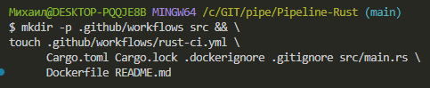

# Pipeline-Rust
# Pipeline CI на Rust #1 в GitHub Actions
Цель — учебный пример — простой проект, который можно склонировать, настроить и убедиться, что приложение в контейнере с Rust, и GitHub Actions работает

### Вы научитесь:

- Настроить CI для Rust проектов
- Научиться контейнеризировать приложения с Docke
- Сборку Docker-образа
Сохранение артефактов для локального использования
- Rust — это современный язык программирования общего назначения, ориентированный на безопасность, скорость и параллелизм

## 1. Создайте на GitHub новый публичный репозиторий my-rust-app с README.md
Склонируйте его себе, откройте в VS Code и создайте такую структуру будущего проекта:

Структура проекта
```
my-rust-app/
├── .github/
│   └── workflows/
│       └── rust-ci.yml
├── src/
│   └── main.rs
├── Cargo.toml
├── Cargo.lock
├── Dockerfile # ваш Dockerfile для сборки приложения
├── .dockerignore
├── .gitignore
└── README.md
```

### Структуру проекта можно сделать одной bash-командой, которая автоматически создаст все файлы и каталоги проекта:
```
mkdir -p .github/workflows src && \
touch .github/workflows/rust-ci.yml \
      Cargo.toml Cargo.lock .dockerignore .gitignore src/main.rs \
      Dockerfile README.md
```

